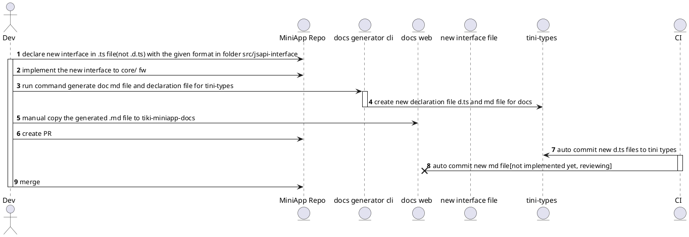
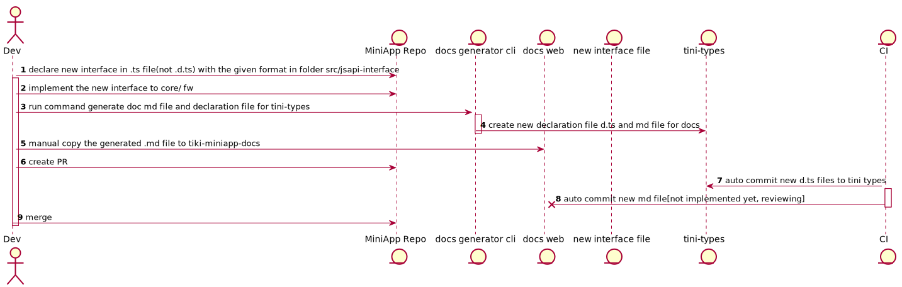

## Cách viết type cho một JSApi

### Bước 1. Tạo một file .ts đại diện cho một JSApi trong thư mục `src/jsapi`  và thêm hvào header:

```ts
import { ICommonParams } from '../common-types'

/**
 * ---
 * title: <title của docs khi generate>
 * description: <desc của docs khi generate>
 * ---
 */

/**
 * 
 * <!-- comment example for developer, docs sẽ không render text này -->
 */
```

Ví dụ: `src/jsapi/my-request.ts`

### Bước 2. trong file ts vừa tạo, export 3 interfaces với format:
JSAPI<TênApi>Main: interface describe api function
ex:
```ts
export interface JSAPIRequestMain {
  /**
    *
    * <describe jsapi description follows Markdown format>
    *
    * ## Sample Code
    * ### File javascript
    * ```js
    *<mini app example code - developer cần thêm example code vào đây cho mỗi api>
    * ```
    * ### File txml
    * ```xml
    *<mini app example code>
    * ```
    */
  (
    paramsObject: JSAPITênApiOption<Data>
  ): JSAPITênApiReturn;
}
```
JSAPI<TênApi>Option: interface này cần extends `ICommonParams<JSAPITênApiSuccessPayload>`, interface này define params object cho js api, ICommonParams là interface describe các common param như callback success,fail,complete;

JSAPI<TênApi>SuccessPayload: interface này define payload trả về từ success callbackk
JSAPI<TênApi>Return: interface này define return của function (hiện tại các jsapi  hầu như đều return void (undefined), có thể để rỗng.
***Note:***:yêu cầu export interface, không phải typing, interface được viết đơn giản, không nested(xem file example).
 

### Bước 3. Thêm description cho mỗi property trong các interface theo format:

 ví dụ: mô tả desc cho prop `data` là required
```ts
export interface JSAPIRequestSuccessPayload<Data extends Object = {}> {
  /**
   * <description cho property data>
   */
  data: Data;
  // ...codes 
```

 ví dụ: mô tả desc cho prop `data` là optional
```ts
export interface JSAPIRequestSuccessPayload<Data extends Object = {}> {
  /**
   * <description cho property data>
   */
  data?: Data;
  // ...codes 
```


 ví dụ: mô tả desc cho prop `data` là optional nhưng có defaultValue
```ts
export interface JSAPIRequestSuccessPayload<Data extends Object = {}> {
  /**
   * [data=1000] <description cho property data>. 
   */
  data: any;
  // ...codes 
```

 
 ***Note:***: Một số JSAPI cần có generict type để support ts, js codesuggestion như my.request. tham khảo https://www.typescriptlang.org/docs/handbook/2/generics.html


## Flows


New flow for implementing new JSAPI



